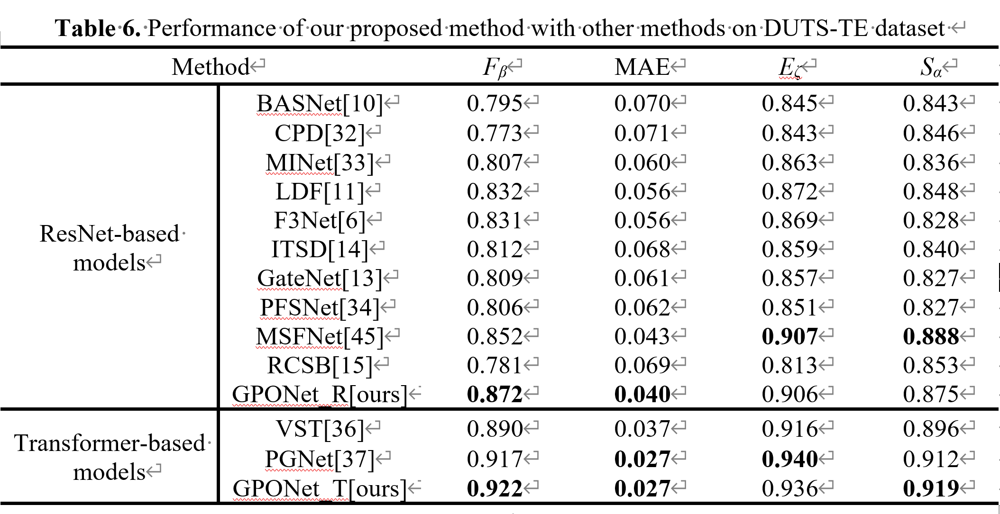
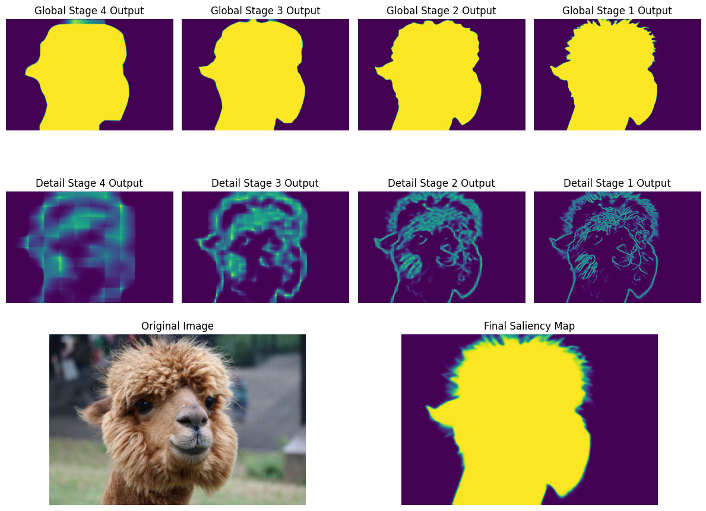
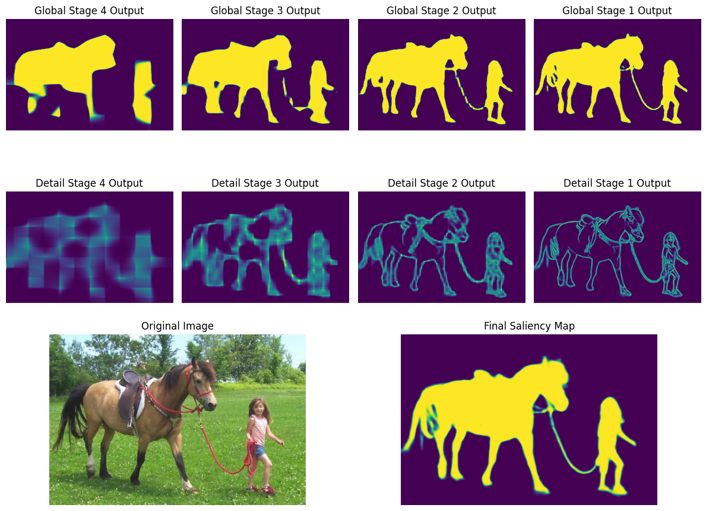
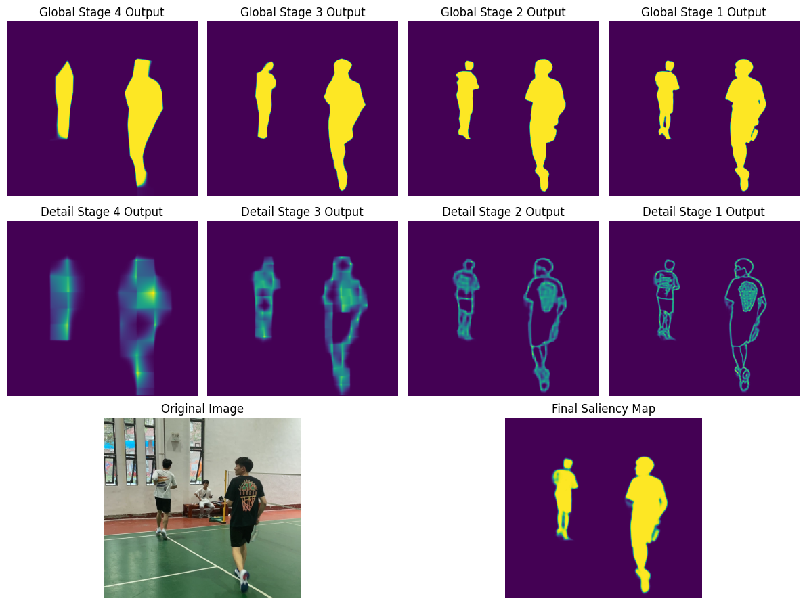
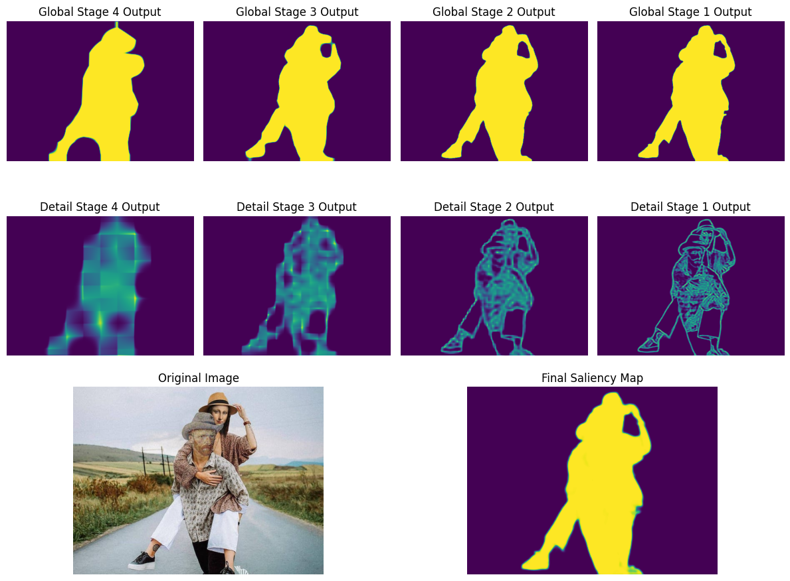

## GPONet: Two-Stream Gated Progressive Optimization Network for Salient Object Detection

------

This is a pytorch implementation of GPONet (Gated Progressive Optimization Network)


### requirements

------

- torch 2.0.1+cu117
- torchvision 0.15.2+cu117
- matplotlib 3.7.1
- pillow 10.0.0
- tqdm 4.65.0
- numpy 1.24.3

```
pip install -r requirements.txt
```


### Training and inference 

------

##### Training

1. Download the DUTS dataset from [Baidu](https://pan.baidu.com/s/1XXDHiNJo-P5oUBJpfSNpaQ?pwd=6h6y) and place it in the `data/` folder
2. Download the  pre-trained backbone model from [Baidu](https://pan.baidu.com/s/1S-ZQNJrcVI2vfHCgcmHMYw?pwd=8agb) and place it in the `model/backbone` folder
3. Runing the training process by command `python train.py`

##### Inference

1. Download the pre-trained model *GPONet_t.pth* from [Baidu](https://pan.baidu.com/s/1K_ui-_oAZt_GoVYyA1YwkA?pwd=egco) and place it in the `save_models/` folder
2. Runing the inference process by command `python infer.py`

We also provide the [predicted saliency maps](https://pan.baidu.com/s/12RwPaOGGuMAKKjP8w2mPNA?pwd=ish0) for DUTS-TE, ECSSD, PASCAL-S, HKU-IS, DUT-OMRON


### GPONet Architecture

------


### Quantitative Comparisons

------




### Visual Comparisons

------


#### Demo

1. Put the local files in the `test_images/` folder and run `python train.py`
2. Some of the results are as follows:







